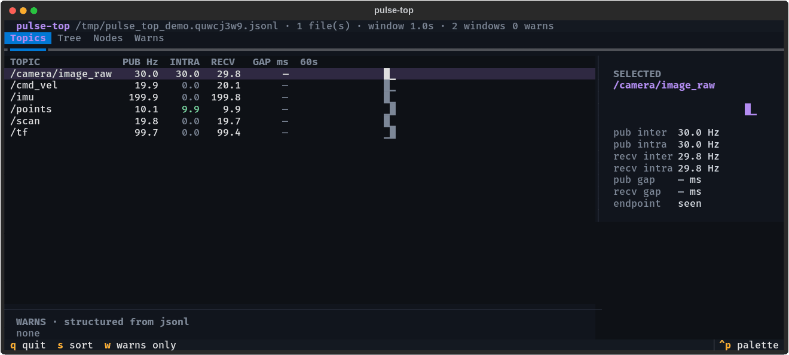
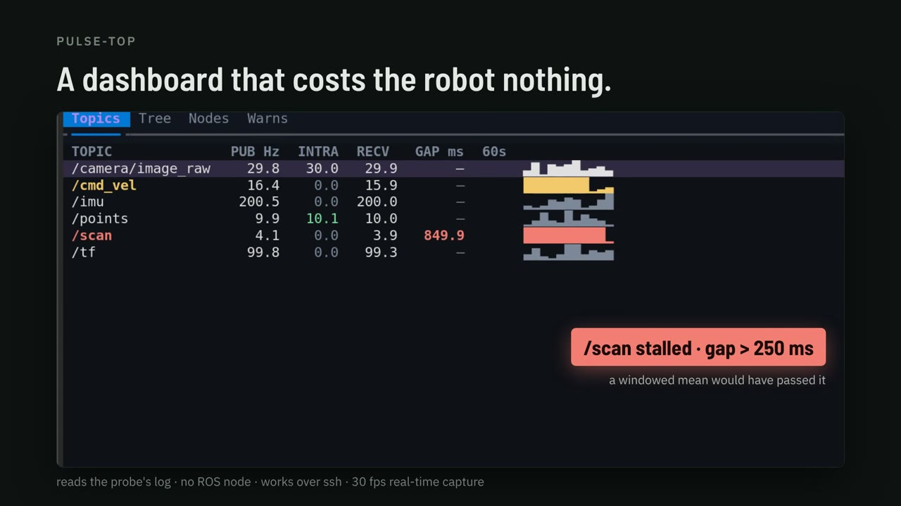

# ros2_pulse

**The heartbeat of your ROS 2 graph.** A low-overhead probe that measures per-topic message
rate and active-node liveness for both inter-process and intra-process traffic, on stock ROS 2
binaries, with no rebuild, no privileges and no network traffic. The counting hot path costs
under a nanosecond per message; the whole probe costs about 2 % of workload CPU on a harsh
4,900 msg/s stress and less on real graphs.

[](https://github.com/TanayK07/ros2_pulse/actions/workflows/ci.yml)
[](https://docs.ros.org/)
[](LICENSE)
[](https://tanayk07.github.io/ros2_pulse/)



*`pulse-top --demo`: the probe's log, live. Sparklines per topic, intra-process rates, structured warnings with ages. [Install](tools/pulse-top/).*

[](https://github.com/TanayK07/ros2_pulse/releases/download/v0.4.0/ros2_pulse-launch.mp4)

*Forty seconds on what watching a topic costs and what the probe does instead. [Watch the video](https://github.com/TanayK07/ros2_pulse/releases/download/v0.4.0/ros2_pulse-launch.mp4) (MP4, 10 MB) or read the [docs](https://tanayk07.github.io/ros2_pulse/).*

---

## Why

The question in production is simple: is every topic flowing at the rate it should, and which
nodes are alive? The existing tools each fall short of answering it.

- `ros2 topic hz` and `ros2 topic echo` subscribe to one topic at a time. Watching a single
  100 KB topic costs 7 % of a core with `hz` and 31 % with `echo`, they cannot see intra-process
  messages at all, and pointing `hz` at an intra-process topic makes the publisher start
  serializing every message, which raised the watched process's CPU by 52 % in our
  [measurements](bench/RESULTS.md#observer-effect-what-watching-a-topic-with-the-stock-cli-costs-2026-08-23).
- Built-in topic statistics are
  [bypassed by intra-process comms](https://github.com/ros2/rclcpp/issues/2911) on Humble-class
  binaries, so composable nodes carrying point clouds lose all introspection. This is fixed on
  `rolling` and newer by [rclcpp#3130](https://github.com/ros2/rclcpp/pull/3130) (merged April
  2026); there is no public Humble backport as of this writing.
- `ros2_tracing` / LTTng is built for offline analysis: a session daemon plus post-processing
  of a CTF trace just to get a rate. On Humble it also needs ROS rebuilt with the lttng-ust
  backend (Jazzy and newer trace out of the box).
- CARET (Tier IV) uses the same hook layer as this probe, LD_PRELOAD over tracetools, which is
  a useful independent validation of the mechanism. It is built for deep offline latency and
  chain analysis and needs LTTng, a forked rclcpp and Jupyter post-processing. Complementary,
  not always-on.
- eBPF uprobes need `CAP_SYS_ADMIN`, debugfs and a kernel with BTF and uprobes, which is often
  a non-starter on Jetson and other embedded targets, and they pay a kernel trap per message.

`ros2_pulse` hooks the tracetools instrumentation layer that rclcpp already calls on every
publish and every callback, counts in-process with a lock-free hot path, and writes ready-to-read
Hz to a small rolling file.

## What you get

```
# ts_ns=1782887153899445923 window_s=5.000
TOPIC /scan 20.000000                      # publish-side, inter-process
PUB   /points inter=0.000000 intra=30.000000   # publish-side incl. intra (Iron+)
RECV  /scan inter=20.000000 intra=0.000000 # receive-side, BOTH transports
RECV  /points inter=0.000000 intra=30.000000   # <- intra-process, invisible to other tools on Humble
JITTER /scan recv max_dt_ms=21.284             # largest inter-arrival gap (opt-in, see below)
NODE  /perception
NODE  /planner
WARN  TOPIC /scan hz=1.200000 expected=[18,22]  # only with an expected-rate spec (see below)
```

If a sidecar exporter or a log shipper is reading instead of a person, `ROS_TOPIC_STATS_FORMAT=jsonl`
writes every window as one JSON object per line with the same gates and values. See
[JSON Lines output](#json-lines-output-ros_topic_stats_formatjsonl).

## How it works

`libros2_pulse.so` is injected with `LD_PRELOAD`. It exports the same symbols as
`libtracetools.so`'s tracepoint API (`ros_trace_rcl_publish`, `ros_trace_callback_start`, the
init tracepoints and so on). The dynamic linker binds rclcpp's calls to ours first; each
interposer records a stat and forwards to the real function through `dlsym(RTLD_NEXT, ...)`.
rclcpp calls these functions unconditionally (the LTTng enable check is inside them), so the
probe works with no tracing session and adds no DDS traffic.

- Intra-process visibility comes from `callback_start(callback, is_intra_process)`, which fires
  for every subscription callback regardless of transport.
- The hot path is a per-endpoint relaxed atomic increment behind a 256-slot thread-local cache
  with a stride-breaking hash. No global lock, no per-message string hashing. Counting costs
  about 0.3 ns/op on a fixed endpoint and 0.6 to 1.2 ns/op alternating across a working set on
  the reference box, two orders of magnitude under a single LTTng-UST tracepoint (about 158 ns).
- A background timer snapshots and resets the counts every `ROS_TOPIC_STATISTICS_PUBLISH_PERIOD`
  seconds and appends the rates to `ROS_TOPIC_STATS_OUTPUT_FILE`.

The pure C++ core (`core/`) has no ROS dependency and is unit tested on its own; the probe layer
(`probe/`) is a thin `LD_PRELOAD` shim.

## Install

```bash
cd ~/ros2_ws/src && git clone https://github.com/TanayK07/ros2_pulse.git
cd ~/ros2_ws && colcon build --packages-select ros2_pulse && source install/setup.bash
```

Requires ROS 2 Humble, Jazzy or Kilted (all three are CI-tested on stock `ros:<distro>` images,
see [Compatibility](#compatibility)) and a `libtracetools.so` with instrumentation compiled in,
which is the default on stock and Isaac binaries. Verify with:

```bash
nm -D $(ros2 pkg prefix tracetools)/lib/libtracetools.so* | grep -c ros_trace
```

## Usage

```bash
export LD_PRELOAD=libros2_pulse.so                      # resolved from the sourced workspace
export ROS_TOPIC_STATS_OUTPUT_FILE=/tmp/pulse.log       # default: $TMPDIR (or /tmp)/topic_freq.<pid>.log
export ROS_TOPIC_STATISTICS_PUBLISH_PERIOD=5.0          # seconds
export ROS_PULSE_EMIT_IDLE=1                            # optional; default 0, see below
ros2 launch your_stack your.launch.py
tail -f /tmp/pulse.log
```
A missing preload library is non-fatal (`ld.so` warns and ignores it), so the variable is safe to
set fleet-wide.

### Environment variables

| Variable | Default | Meaning |
|---|---|---|
| `ROS_TOPIC_STATS_OUTPUT_FILE` | `$TMPDIR/topic_freq.<pid>.log` (`/tmp` if `TMPDIR` unset) | Where the stats file is appended. Per process by default; set an explicit path to share one file on purpose. The default open refuses symlinks (`O_NOFOLLOW`) because it lives in a world-writable directory; an explicit path may be a symlink. |
| `ROS_TOPIC_STATISTICS_PUBLISH_PERIOD` | `5.0` | Flush/snapshot window, in seconds. |
| `ROS_TOPIC_STATS_MAX_BYTES` | `10485760` (10 MiB) | Size cap: at or over it the file rotates to `<path>.1` (single generation, worst-case disk = 2x cap per process). `0` disables rotation (pure append). The file is reopened per window, so external logrotate also works. |
| `ROS_TOPIC_STATS_JITTER` | `0` | When `1`, measure per-endpoint inter-arrival gaps and emit a `JITTER <topic> <side> max_dt_ms=...` line for each side that saw traffic. Any `max_gap_ms` rule in the spec also switches it on, so a declared rule is never silently unchecked. Costs one clock read per message: +24 ns on x86-64, +51 ns on a Jetson AGX Orin, about 0.01 to 0.03 % of a core at 4,900 msg/s ([measured](test/orin/RESULTS.md)). Opt-in for that reason. |
| `ROS_PULSE_EMIT_IDLE` | `0` | When `1`, also emit a `TOPIC /x 0.000000` line for a declared but silent topic (no traffic in the window). By default such topics are omitted so a large graph is not padded with a zero line per silent topic every window. Only the publish-side `TOPIC` line is affected: `RECV` emits an explicit `0.000000` line for topics that have delivered at least once (so a stalled upstream stays visible) and omits never-active topics. |
| `ROS_TOPIC_STATS_EXPECTED` | unset | Path to an expected-rate spec (below). When set, each window is checked at flush time and violations are appended as `WARN` lines. Unreadable or malformed specs warn once on stderr and disable alerting; they never crash the host. |
| `ROS_TOPIC_STATS_QUIET` | `0` | When `1`, suppress the `[ros2_pulse] active` stderr banner, for deployments that parse the wrapped process's stderr. Only the informational banner is silenced. Error diagnostics (unreadable, malformed or zero-rule spec, unwritable output file) still print, because each of those disables something you configured, and silently disabled alerting is the 0.2.0 bug class this flag must not bring back. |
| `ROS_TOPIC_STATS_FORMAT` | `text` | Output encoding: `text` (the block format above, byte-identical to previous releases) or `jsonl` (one JSON object per window per line, see below). Any other value warns once on stderr and falls back to `text`; it never crashes the host. `pulse-check` reads both. |

### JSON Lines output (`ROS_TOPIC_STATS_FORMAT=jsonl`)

For sidecar exporters (Prometheus, OpenTelemetry) and log shippers: each flush window becomes one
JSON object on one line, `\n`-terminated, UTF-8 ([jsonlines.org](https://jsonlines.org/)), so
`tail -f pulse.log | jq .` works as is. Same emit gates, same values, same precisions as the text
format; only the encoding changes.

```json
{"ts_ns":"1782887153899445923","window_s":5.000,"topics":[{"topic":"/scan","pub_inter_hz":20.000000,"pub_intra_hz":0.000000,"recv_inter_hz":20.000000,"recv_intra_hz":0.000000,"recv_endpoint_seen":true,"recv_max_dt_ms":21.284}],"nodes":["/perception"],"warns":[{"kind":"topic_rate","topic":"/scan","hz":1.200000,"min_hz":18,"max_hz":22}]}
```

Schema rules, pinned by golden-byte unit tests:

- `ts_ns` is a decimal string, not a JSON number. Epoch nanoseconds (about 1.8e18) exceed
  2^53-1, so a number would silently lose the low digits in every IEEE-754 double consumer
  (JavaScript, `jq`). OTLP/JSON encodes `timeUnixNano` and every (u)int64 field the same way.
- An absent key means "not measured", never 0. `pub_*`/`recv_*` pairs appear only when the
  matching text line would, and `pub_max_dt_ms` / `recv_max_dt_ms` only when gap tracking
  measured that side (`ROS_TOPIC_STATS_JITTER`). A missing gap is unknown, not "perfectly
  smooth".
- `topics`, `nodes` and `warns` are always present (empty arrays when empty), so `.warns[]`
  needs no null guards.
- `warns` are structured (`kind` is `topic_rate`, `topic_gap` or `node_missing`, with the
  numbers as JSON numbers) rather than preformatted strings. An unbounded `max_hz` omits the
  key, since JSON has no `Infinity`. The text `WARN` line is a rendering of the same data.
- Topic and node names are escaped per RFC 8259, so a hostile name cannot break the
  one-object-per-line framing.

`pulse-check` sniffs the format per line (a `{` first byte can only be a jsonl record), so
watchdog and CI gating work unchanged on jsonl logs. A file of non-probe JSON still exits 2
(`no probe windows`) rather than passing.

### Expected-rate alerting

Declare what "healthy" means and let the probe say when reality disagrees, for the whole process
tree at once and without per-node `diagnostic_updater` code:

```yaml
# /etc/pulse/expected.yaml, a documented YAML subset (flow-map topic rules; no YAML lib in the probe)
topics:
  /scan:   {min_hz: 18, max_hz: 22, side: recv}   # side: pub|recv (default recv)
  /scan:   {min_hz: 18, side: pub}                # same topic, other end, allowed
  /points: {min_hz: 25, transport: intra}         # transport: inter|intra|any (default any)
nodes: [/perception, /planner]                    # expected alive
```

`transport: any` is the topic's rate however it travels. On the receive side the two buckets are
disjoint deliveries, so they are summed. On the publish side one `publish()` can fire both the
intra-process and the RMW tracepoint for the same message (Iron and newer, and always under
TransientLocal QoS on Jazzy and newer), so the larger bucket is used rather than the sum.

```bash
export ROS_TOPIC_STATS_EXPECTED=/etc/pulse/expected.yaml
```

Violations render inside the normal window block. They are additive, so existing parsers are
unaffected:

```
WARN TOPIC /scan hz=1.200000 expected=[18,22]
WARN NODE /planner missing
```

#### Catching stalls a rate bound cannot see

A windowed mean cannot detect a freeze. At 50 Hz with `min_hz: 45` and the default 5 s window,
the rule fires only below 225 messages, which is more than half a second of dead time. A 400 ms
freeze, 20 lost cycles and catastrophic for a control loop, reports 46 Hz and passes. Widening
the window makes it worse: the same 2 s stall at a 20 s window averages to exactly 45.0 Hz and
never fires. One 500 ms freeze and 500 spread-out 1 ms hiccups both read 45.0 Hz.

`max_gap_ms` bounds the largest inter-arrival gap instead, which does not depend on the window
length:

```yaml
topics:
  /scan:    {min_hz: 45, max_gap_ms: 60, side: recv}   # too slow AND frozen are different faults
  /cmd_vel: {max_gap_ms: 30, side: pub}                # gap-only rules are valid on their own
```

```
WARN TOPIC /scan max_dt_ms=812.400 expected_max_gap_ms=60
```

A rule may violate the rate bound and the gap bound independently, producing two lines. Setting
`max_gap_ms` turns measurement on by itself; you do not also need `ROS_TOPIC_STATS_JITTER=1`.
This also covers control loops driven by `rclcpp::Rate` or a raw `sleep_until` rather than a
timer (`ros2_control`, Nav2, MoveIt Servo): they publish, so their stalls show up here.

Evaluation happens only at flush time (the hot path never sees the spec) and each probed process
only judges endpoints it hosts. The first window (attach ramp-up) and the final atexit window (a
sub-period sliver whose rate is a one-sample estimate) are skipped, so a healthy start or stop
never raises an alert. Their rates are still logged.

`pulse-check` turns any log, or a set of per-process logs, into an exit code for watchdogs,
systemd or CI. It re-derives the verdict from the raw rates of the last window and needs no ROS:

```bash
# live watchdog: the last window IS the current state
pulse-check --spec /etc/pulse/expected.yaml /tmp/pulse.*.log && echo healthy

# post-run CI gate: the stack has exited, so skip its atexit window
pulse-check --spec /etc/pulse/expected.yaml --skip-last /tmp/pulse.*.log

# exit 0: pass   1: violations (printed)   2: bad input
# a max_gap_ms rule whose logs carry no JITTER line is exit 2, not a pass: the check could not
# be performed, and reporting that as healthy would be wrong. Measured violations still print.
# offline it owns the whole picture: a spec topic in NO log is reported at 0 Hz
```

Use `--skip-last` on logs from a stack that has already stopped: the probe's final window is the
atexit flush, a sub-period sliver whose rate is a one-sample estimate, so gating on it can go red
on a healthy shutdown. It needs at least 2 windows per log (3 to also clear the ramp-up window).
Receive rates sum across logs, so `max_hz` belongs on `side: pub`: K subscriber processes on one
topic legitimately report K times the publish rate.

## Benchmarks

Measured in `ros:humble`, `ros:jazzy` and `ros:kilted` containers with a workload of about
4,900 msg/s across 53 mixed topics (30 light at 100 Hz, 8 heavy of about 100 KB at 50 Hz
inter-process, 15 intra-process at 100 Hz), a harsh stress by design. Paired, order-alternated
trials (N=10 per distro) with error bars; the harness and method are in [`bench/`](bench/).

| Method | CPU overhead | Monitor's own cost | Disk | Intra-proc | Stock binaries | Privileges |
|---|---|---|---|---|---|---|
| ros2_pulse | about +2 % at worst-case stress (pooled +1.9 % ± 0.7 % across humble/jazzy/kilted; about 1 µs/msg all in) | in-process | about 22 KB rolling | yes | yes | none |
| eBPF uprobe | noise at this rate¹ | bpftrace process | 0 | yes | yes | CAP_SYS_ADMIN + BTF |
| LTTng / ros2_tracing | captured 0 events on stock binaries² | daemons | CTF (large) | yes | needs rebuild | sessiond |

The counting hot path measures about 0.3 ns/op warm-cache and 0.6 to 1.2 ns/op alternating
endpoints, two orders of magnitude under one LTTng-UST tracepoint (about 158 ns). The
end-to-end 2 % is the diffuse footprint of observing at all (chained tracepoints, cache and TLB
residency), attributed by controlled experiments in [`bench/RESULTS.md`](bench/RESULTS.md).
Real graphs with lower aggregate rates see proportionally less.

¹ A uprobe is a per-event kernel trap of about a microsecond and grows with message rate.
² Stock `libtracetools.so` is not always linked to lttng-ust; then the tracepoints are no-ops.
See [`bench/RESULTS.md`](bench/RESULTS.md).

On a Jetson AGX Orin (aarch64, L4T R36.4, a production 77-node Humble/CycloneDDS stack) the
probe loads into every process on the stock deployed binaries, opens 0 sockets, and the hot path
measures 0.9 ns/op fixed and 2.1 ns/op alternating. The opt-in jitter clock read costs
+51 ns/msg ± 0.6 (vs +24 on x86). The `CLOCK_MONOTONIC` vDSO works on this kernel; the
difference is a slower clock, not a syscall fallback. Raw trials and the redacted production log
are in [`test/orin/RESULTS.md`](test/orin/RESULTS.md).

## Limitations

- On ROS 2 Humble there is no intra-process publish tracepoint, so intra rate is measured
  receive-side (per subscription), which is usually the signal you want. On Iron and newer the
  probe also hooks `rclcpp_intra_publish` and emits an additive `PUB` line with publish-side
  intra rates.
- Node liveness is traffic-derived. There is no node-teardown tracepoint on stock Humble, so a
  node appears in the `NODE` lines only while a topic it publishes or subscribes to has carried
  traffic within the last few windows; a node silent for several windows is treated as quiet and
  drops out. A live but idle node (a pure timer or service node with no topic traffic) therefore
  reads as quiet. Re-initialising a node name does not duplicate its entry.
- Requires tracing instrumentation compiled into the ROS build (the default on Humble and Isaac
  debs; checkable at runtime with `ros_trace_compile_status()`).
- Python (rclpy) nodes are counted on the publish side only. `rcl_publish` fires in the C layer,
  so Python publishers are counted, but `callback_start` is rclcpp-only and rclpy was never
  instrumented ([ros2_tracing#15](https://github.com/ros2/ros2_tracing/issues/15)), so a Python
  subscriber's deliveries do not appear in `RECV` lines.
- File output only; no live network export, by design.

## Compatibility

| Distro | Status | Notes |
|---|---|---|
| Humble (LTS, EOL 2027) | CI-tested | tracetools ships without the LTTng backend, the case where this probe is the only zero-rebuild option |
| Jazzy (LTS, EOL 2029) | CI-tested | full suite green on stock `ros:jazzy`; tracetools is LTTng-enabled and the probe forwards, so a live tracing session coexists |
| Kilted | CI-tested | full suite green on stock `ros:kilted` |
| Rolling | non-blocking CI lane | observational, watches upstream churn |
| Iron | not targeted | EOL December 2024 |

On Iron and newer the probe additionally hooks the dedicated `rclcpp_intra_publish` tracepoint,
so publish-side intra rates appear on an additive `PUB` line. On Humble intra stays receive-side
because the tracepoint does not exist there.

### Middleware (RMW) matrix

The hooks bind above the rmw layer (rclcpp and rcl call the tracetools functions before any
middleware sees the message), so the probe should be RMW-agnostic by construction. "Should" is
not a support claim, so every row below is measured by `test/rmw/run_rmw_matrix.sh <distro>`
(one command, re-runnable): talker and listener as separate processes plus an intra-process node,
probe preloaded, and publish-side `TOPIC`, receive-side `RECV inter` and `RECV intra` each
asserted at the nominal 50 Hz ±30 % with the same parser the CI accuracy suite uses. Evidence
(probe logs, per-process stderr, daemon logs, exact deb versions) lands in `test/rmw/out/`.

All four configurations passed on `ros:humble`, `ros:jazzy` and `ros:kilted` on 2026-08-08. The
quoted rates are from the jazzy run; humble and kilted matched within ±0.1 Hz (full per-distro
logs under `test/rmw/out/`):

| RMW | Status | Evidence |
|---|---|---|
| `rmw_fastrtps_cpp` (the default on all three distros) | CI-tested | every integration lane runs it; kept as the matrix control leg. TOPIC 50.007 / RECV inter 50.002 / RECV intra 50.055 Hz |
| `rmw_cyclonedds_cpp` | validated | rmw 1.3.4 (humble) / 2.2.3 (jazzy) / 4.0.2 (kilted), cyclonedds 0.10.5. TOPIC 50.022 / RECV inter 50.020 / RECV intra 50.019 Hz |
| CycloneDDS + iceoryx SHM | validated¹ | iceoryx-posh 2.0.5 to 2.0.6: `iox-roudi` up, `<SharedMemory><Enable>true</>`, fixed-size UInt64 pair (String is not SHM-eligible). TOPIC 50.002 / RECV inter 50.002 Hz |
| `rmw_zenoh_cpp` (no DDS in the process at all) | validated | rmw-zenoh-cpp 0.1.9 (humble) / 0.2.9 (jazzy) / 0.6.6 (kilted, [Tier 1 there](https://github.com/ros2/rmw_zenoh/issues/265); the default RMW everywhere is still FastDDS), `rmw_zenohd` router up for discovery. TOPIC 50.000 / RECV inter 50.001 / RECV intra 50.055 Hz |

¹ What the SHM run proves: both processes attach to RouDi (`roudi.log`), CycloneDDS creates
iceoryx endpoints for the measured topic in both processes (`Writer's/Reader's topic name will
be DDS:Cyclone:rt/chatter_fixed` in the per-process `Tracing shm` logs), and the probe reads
50 Hz on both sides throughout. Per-sample SHM-versus-loopback attribution is internal to
Cyclone (stock images ship no scriptable iceoryx introspection), so that residual is stated
rather than papered over. The claim under test, that the probe's numbers are transport
independent, holds either way.

## Contributing

See [CONTRIBUTING.md](CONTRIBUTING.md). Issues and PRs welcome.

## License

Apache-2.0. See [LICENSE](LICENSE).
